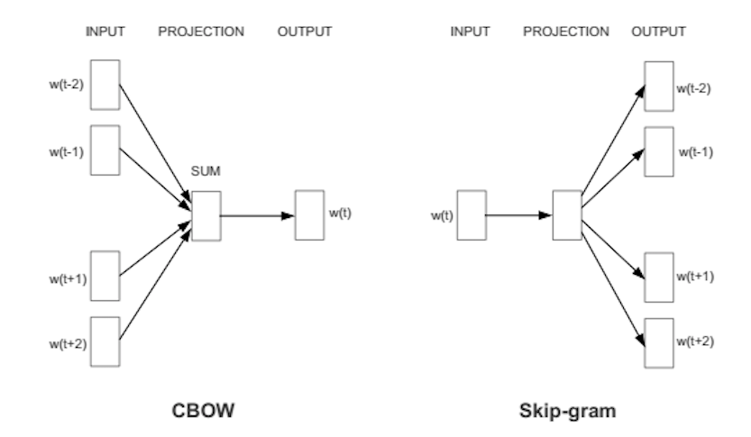
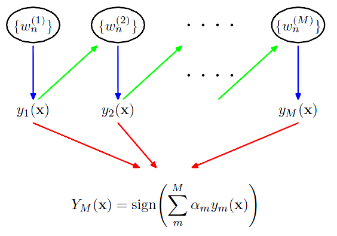
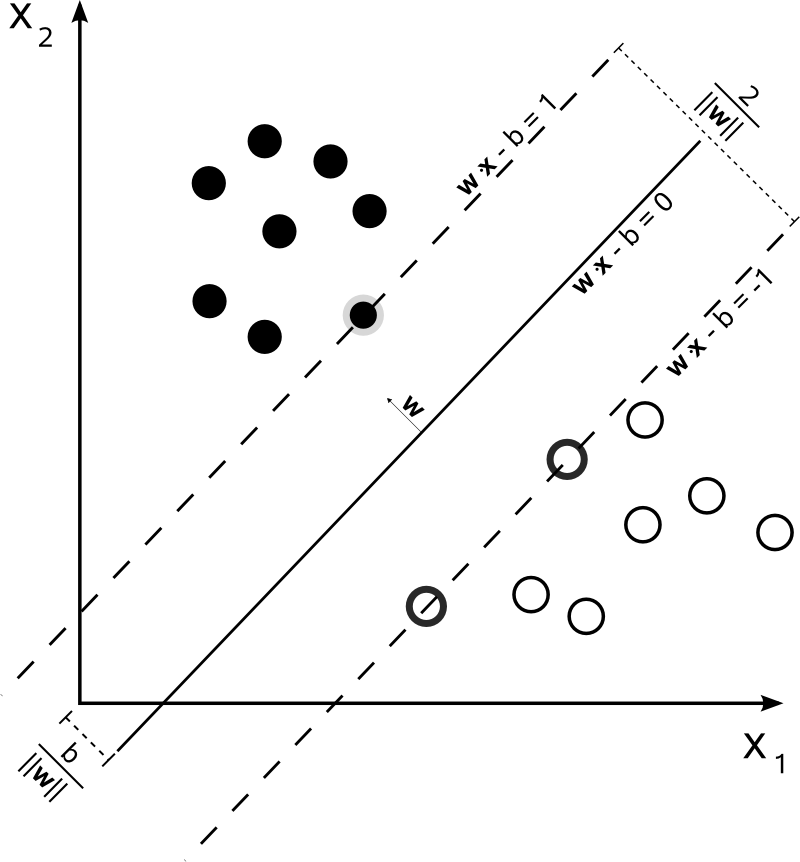
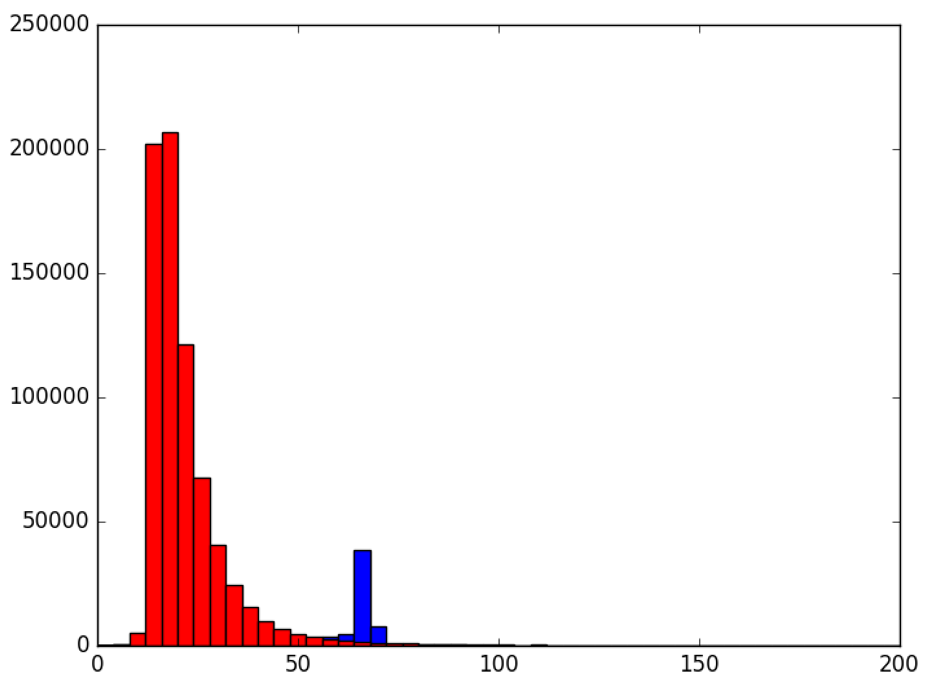
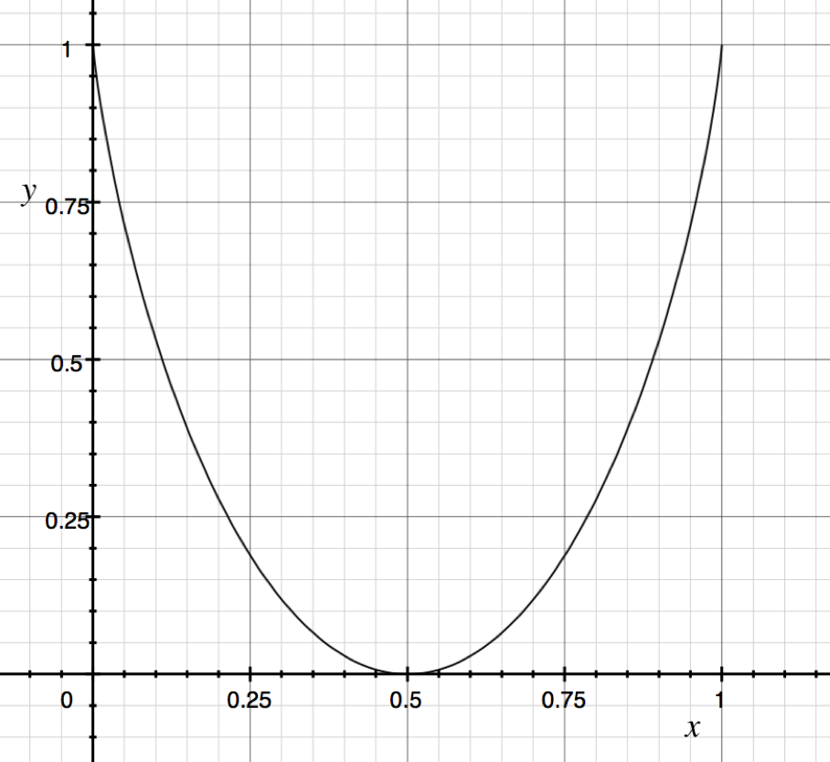
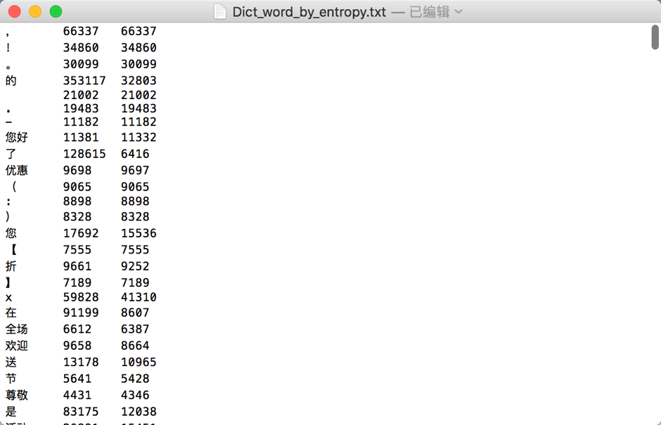

# 基于内容挖掘的垃圾短信分类算法研究与实现

## 前言

随着近几年我国移动通信技术以及基础设施建设的快速发展，智能手机用户数量飞快增加。根据工信部《2014年通信营业同级公报》显示，截止到2014年，我国移动电话已达到12.8亿部，2014年我国手机短信发送总量已达到7630.5亿条。人们在享受手机短信带来的便利的同时，也受到了垃圾短信的骚扰，有的甚至造成经济损失。据《2015上半年中国移动互联网安全报告》显示，中国手机用户半年接收到的垃圾短信总数近200亿条。不法分子为了追求经济利益，发送大量中奖诈骗、冒充银行扣款诈骗、网络购物诈骗、非法金融活动等垃圾短信，不仅耗费网络资源，影响在正常短信的传输，微信手机数据的安全，更是让广大手机用户遭受经济损失。根据中国互联网协会公布的《中国网民权益用户调查报告（2015）》显示，近一年来，全国网民经济财产损失高达805亿元。垃圾短信的自动识别和过滤愈发必要。

垃圾短信分类技术[@钟延辉2009基于文本挖掘的垃圾短信过滤方法]主要黑白名单分类技术、基于规则的分类技术、基于关键字的分类技术和基于内容挖掘的分类技术等，其中基于内容挖掘的分类技术不仅分类效果好，而且拥有自学习的能力。早期对基于文本挖掘垃圾短信分类的研究包括：2004年文献[@xiang2004filtering]中提出了支持向量机适用于垃圾短信分类问题、2005年文献[@healy2004assessment]考虑使用K-NN分类器，但都未作出具体的评估，直到2006年文献[@gomez2006content]在两个垃圾短信数据集上进行测试，证实了其有效性，并且支持向量机的效果更好。2009年文献[@longzhen2009new]提出将K-NN作为多过滤分类器中的一个环节，首先短信经过黑白名单的过滤之后再经过一个粗糙集分类，如果粗糙集分类将此短信视为垃圾短信，则被丢进K-NN做最后的确认。在一个包括550条垃圾短信和200条非垃圾短信的数据集上，当Ｋ=12时，这个复合分类器比单个K-NN分类器更加快和准确。2010年文献[@liu2010index]提出了一个计算短信“垃圾系数”的简单索引模型。2011年，文献[@junaid2011using]对13种有监督学习方发做出了比较，包括朴素贝叶斯、线性SVM、最小描述长度分类器、K-NN、决策树C4.5、PART等。结果发现线性SVM精确度可以达到97.64%，垃圾短信上的召回率为83.1%。改进朴素贝叶斯和改进C4.5以及PART精确度达到97.5%。

本报告对基于内容挖掘的垃圾短信分类常用算法进行探讨、实现、对比和分析。

## 相关工作

基于内容挖掘的短信分类技术流程如下图所示：

样本被分为训练样本和测试样本两大部分并基于语料库分别提取特征，构造一个分类器并利用训练样本的特征训练分类器，最后将测试样本的特征输入分类器完成分类。其中最为关键的两大重要步骤：提取文本特征、构建文本分类器。

### 文本特征提取

文本特征提取包括分词、预处理、文本表示、特征提取等几个关键环节。

#### 分词

文本分类首先要对文本进行分词处理。英文有天然的空格分隔符，而中文的词与词之间并没有分个标记，因此要先将短信文本进行分词处理，讲短信风格成若干词语的组合。分词算法主要有基于统计、基于词典、基于语法等。目前，很多中文分词的平台和库效果足以达到可以正常使用。

#### 预处理

文本预处理主要是对文本进行停用词、标点符号、非法字符过滤，是分词后对文本做的一次优化。在中文中虚词、连接词、感叹词、介词、副词等出现频率高，但却没有实质意义，反而会影响分类的准确性，因此要去掉。

#### 文本表示

将文本进行分词和预处理之后，就要讲文本表示成对应的特征项，表示成计算机所能识别的模型。常用的特征表示法主要有向量空间模型表示法、布尔逻辑型表示法、LDA生成模型等。

向量空间模型表示法是将文本视为多个词语的集合，特征项在文本中出现的频率决定了短信文本所属类别，而这些词的先后顺序不被关注，每个特征词对应文本特征向量中的一个元素，从而将短信文本表示成一个由特征项的权重所构成的向量，权重一般与频率相关。该模型简单高效，在实际应用中使用较多。

布尔逻辑型表示法则是采用布尔值来表示一段文本中是否出现了某个值。若文本$d_i$中出现了特征词$w_j$，则对应的关联矩阵中的元素$r_{ij}=0$，否则$r_{ij}=1$。此方法简单便捷，但不能体现某词在某文本中的使用频率。

LDA（Latent Dirichlet Allocation）是一种文档主题生成模型，也成为一个三层贝叶斯概率模型。认为“以一定概率选择了某个主题，并从这个主题中以一定概率选择某个词语”。

#### 特征提取

通过文本表示得到的向量往往是高维的，这会导致需要分类器花更多的时间和样本继续学习，而且中文文本具有无结构化的特点，且大部分词对分类的贡献很小，有的甚至严重影响分类结果。特征提取是指通过函数映射（或变换）的方法，选择代表意义较强、分类性较好的特征项进行文本表示，组合成新的向量。常用的特征选择方法[@钟延辉2009基于文本挖掘的垃圾短信过滤方法]有：特征频度(TF)[]、文档频率(DF)、特征熵(TE)、互信息(MI)、信息增益(IG)[@yang1997comparative]、$\chi^2$统计量(CHI)[@ronglu2005using,]，相关系数(CC)、特征权(TS)、期望交叉熵(ECE)[@schutze1995comparison]、文本证据权(WET)和几率比(OR)等11种。

其中，CHI的主要思想[@mikolov2013distributed]是认为词条与类别之间符合$\chi^2$分布，词条的$\chi^2$统计量表示词条对某个类别的贡献大小。$\chi^2$统计量越高，词条和类别之间的独立性越小、相关性越强，即词条对此类别的贡献越大。词条$i$对应类别$j$的$\chi^2$统计量的计算公式如下：

$$
\chi_{ij}^2=\frac{n\times (n_{11}\times n_{22}-n_{12}\times n_{21})^2}{(n_{11}+n_{12})\times (n_{21}+n_{22})\times (n_{11}+n_{21})\times (n_{12}+n_{22})}
$$

其中$n_{11}、n_{12}、n_{21}$和$n_{22}$分别表示词条$i$在类别$j$中出现的频数、词条$i$在类别$j$外的其他类别中出现的频数、除词条$i$外的其他词条在类别$j$中出现的频数，除词条$i$外的其他词条在除类别$j$外的其他类别中出现的频数，$n$为所有词条的频数总和。$\chi^2$统计量的计算方法说明了词条对类别贡献程度。

Word2vec是Google在2013年年中开源的一款将词表征为实数值向量的高效工具，其利用深度学习的思想，通过训练，把文本表示为一个K维向量。Word2vec是Mikolov等[@mikolov2013distributed]所提出模型的一个实现，可以用来快速有效地训练词向量。Word2vec包含了两种训练模型，分别是CBOW和Skip_gram，如下图所示

从上图中可以看出,CBOW和Skip_gram模型均包含输入层，投影层和输出层。其中，CBOW模型通过上下文来预测当前词，Skip_gram模型则通过当前词来预测其上下文。Word2vec考虑了词的上下文，语义信息更加地丰富。然后利用词向量进而构造语句特征。

### 文本分类算法

#### 随机森林

随机森林分类（RFC）[@李欣海2013随机森林模型在分类与回归分析中的应用]是由很多决策树分类模型${h(X,\Theta_k),k=1,\ldots}$组成的组合分类模型，且参数集${\Theta_k}$是独立同分布的随机向量，在给定自变量$X$下，每个决策树分类模型都由一票投票权来选择最优的分类结果。RFC的基本思想：首先，利用boostrap抽样从原始训练集抽取$k$个样本，且每个样本的样本容量都与原始训练集一样；其次，对$k$个样本分别建立$k$个决策树模型，得到$k$种分类结果；最后，根据$k$种分类结果对每个记录进行投票表决，决定其最终分类，如下图：

RF 通过构造不同的训练集增加分类模型间的差异，从而提高组合分类模型的外推预测能力。通过$k$轮训练，得到一个分类模型序列${h_1(X),h_2(X),\ldots,h_k(X)}$，再用它们构成一个多分类模型系统，该系统的最终分类结果采用简单多数投票法，最终的分类决策为:

$$
H(x)=\arg\max_Y\sum_{i=1}^kI(h_i(x)=Y)
$$

其中，$H(x)$表示组合分类模型，$h_i$是单个决策树分类模型，$Y$表示输出变量（或称目标变量），$I(*)$为示性函数，上式说明了随机森林是如何通过多数投票决策的方式来确定最终分类结果的。

大量的理论和实证研究都证明了RF具有很高的预测准确率，对异常值和噪声具有很好的饿哦那个人都，且不容易出现过拟合，RF是一种自然的非线性建模工具，是最常用的数据挖掘方法之一。

#### Gradient Boosting

Boosting是一种可以提高任意给定学习算法准确率的算法。它起源于Valiant提出的近似正确(Probably Approximately Correct, PAC)学习模型。Kearns和Valiant[@kearns1994cryptographic]证明当训练样本足够多的情况下，一系列效果仅仅比随机猜测性能强的弱分类器可以组合成任意性能很好的组合分类器。Boosting算法的思想十分简单，如下图所示，即对一份数据建立$M$个模型，一般来说这些模型均比较简单，也就是我们经常说的弱分类器。每次分类时，都将上一次分错的数据的权重提高一些再次进行分类。这样，最终得到的分类器组合不论在训练数据还是测试数据上都可以得到比较好的效果。

Gradient Boosting 是Boosting方法的一种，其主要思想是，每一个模型都是建立在上一次所建立模型的损失函数的梯度下降方向上的。其中，损失函数(Loss Function)表示的是模型的不靠谱程度，损失函数越大说明模型越容易出错。俄日了不停地改进模型，需要持续令损失函数下降，而使其下降最快捷的方式就是让损失函数沿着自己的梯度下降。因此Gradient Boosting与传统Boosting相比在分错样本的权重更新上有较大的区别。

#### 支持向量机

支持向量机以统计学习理论为基础，可以很好地处理回归问题、分类问题和判别分析等诸多问题。并在预测和综合评价等问题中也表现出很好的效果。本文主要将支持向量机用于分类问题。

支持向量机的原理在于寻找一个最优分类超平面能够在满足分类要求的同时最大化超平面两侧的空白区域。如下图

{#fig:svm,width:300px}

已两类线性分类为例，给定训练数据集$(x_{i},y_{i}),i=1,2,\ldots,l,x\in R^{n},y\in{1,-1}$，将超平面记做$(\omega\cdot x_{i})+b=0$，其中$\omega$是一个$n$维向量，b是一个常量。为使分类将所有样本分类正确并有分类间隔，需要满足约束：$y_{i}(w\cdot x_{i}+b)\ge 1\quad\quad i = 1,2,\ldots,n$

可以计算出分类间隔为$2/\lvert \omega \rvert$，因此求解最优化超平面可以转化成如下约束式进行求解：
$$\min\Phi(\omega) = \frac{1}{2}\lvert \omega \rvert^{2} = \frac{1}{2}\omega^T\omega$$
为了解决这个问题，引入拉格朗日函数：
$L(\omega,b,a)=\frac{1}{2}\lvert\omega\rvert-a(y((\omega\cdot x) + b)-1)$
其中，$a_{i}>0$为拉格朗日乘数。最优解由拉格朗日函数的鞍点决定，最优化解应在鞍点处$\omega$和$b$ 的偏导为0，将该问题转换成相应的对偶问题即：
$$
\begin{array}{lll}
maxQ(a) = &\sum_{j=1}^{l}a_{j}-\frac{1}{2}\sum_{i=1}^{l}\sum_{j=1}^{l}a_{i}a_{j}y_{i}y_{j}(a_{i}\cdot x_{j}) & \\
& s.t.\quad \sum_{j=1}^{l}a_{j}y_{j}=0 & j=1,2,\ldots,l,a_{j}\ge0,j=1,2,\ldots,l
\end{array}$$
计算最优解为$a^{*}=(a_{1}^{})$
最优权值向量和最优偏移量，分别为：

$$\omega^{*} = \sum_{j=1}^{l}a_{j}^*y_{j}x_{j}$$
$$b^{*} = y_{i}-\sum_{j=1}^{l}y_{j}a_{j}^*(x_{j}\cdot x_{i})$$

其中，下标$j\in{j|a_{j}^{*}>0}$。得到最优分类超平面$(\omega^*\cdot x) + b^*$，最优分类函数为：

$$
\begin{array}{ll}
f(x)=sign\{(\omega^{*}\cdot x)+b^*\}=\\
sign\{(\sum_{j=1}^{l}a_{j}^{*}y_{j}(x_{j}\cdot x_{i}))+b^*\},x\in R^{n}
\end{array}
$$

对于非线性问题，支持向量机的主要思想是先将输入数据映射到一个高维空间中，使数据在高维空间中线性可分。设从$x$做从输入空间到$R^{n}$到高维特征空间$H$的变换为$\Phi$，得：
$$x\to\Phi(x)=(\Phi_{1}(x),\Phi_{2}(x),\ldots,\Phi_{l}(x))^{T}$$
以特征向量$\Phi(x)$代替输入向量$x$，可以得到非线性最有分类函数为：

$$
\begin{array}{ll}
f(x)=sign\{(\omega^{*}\cdot \Phi(x))+b^*\}=\\
sign\{(\sum_{j=1}^{l}a_{j}^{*}y_{j}(\Phi(x_{j})\cdot \Phi(x_{i}))+b^*\},x\in R^{n}
\end{array}
$$

而寻找合适的映射函数$\Phi$是非常复杂，不容易实现。仔细观察公式,可以发现最优分类超平面只与内积$< x_{i},x_{j}>$有关，因此支持向量机引入核函数来完成从线性到非线性的变换。常用的核函数有：

1. 多项式核函数：$K(x_{i},K_{j})=(x_{1}^{T}x_{1})^{d}$
2. Gauss径向基核函数：$K(x_{i},K_{j})=\exp(-q\lvert x_{1}-x_{2}\rvert^{2})$
3. 其他一些核函数有B-样条函数，Fourier核函数，双曲正切函数等。

#### Logistic 回归

logistic回归是一种广义线性回归（generalized linear model），因此与多重线性回归分析有很多相同之处。它们的模型形式基本上相同，都具有 $w'x+b$，其中w和b是待求参数，其区别在于他们的因变量不同，多重线性回归直接将$w'x+b$作为因变量，即$y =w'x+b$，而logistic回归则通过函数L将$w'x+b$对应一个隐状态p，$p =L(w'x+b$),然后根据p 与1-p的大小决定因变量的值。如果$L$是logistic函数，就是logistic回归，如果L是多项式函数就是多项式回归。

Logistic回归二值分类问题模型为：
$$
P(Y=1|x)=\frac {\exp(w \cdot x + b)} {1 + \exp(w \cdot x + b)} \\ 
P(Y=0|x)=\frac {1} {1 + \exp(w \cdot x + b)}
$$

### 分类结果评价

样本的分类结果分为四种，描述和表示如下表：

| |预测为正样本|预测为负样本|
|:---|:------|:---------|
|标注为正样本|TP(true positive)|FN(false negative)|
|标注为负样本|FP(false positive)|TN(true negative)|

分类的评价准则主要有以下四种：

1. 正确率（Accuracy）=$\frac{正确分类的样本数}{总样本数}=\frac{TP+TN}{TP+FN+FP+TN}$。
2. 精确率(Precision)=$\frac{正确预测的正样本数}{预测为正例的样本数}=\frac{TP}{TP+FP}$。
3. 召回率(Recall)=$\frac{正确预测的正样本数}{标注的正样本数}=\frac{TP}{TP+FP}$。
4. F1=$2\times \frac{Precision\times Recall}{Precision+Recall}$。

### 实验

#### 长度统计分类
首先，通过对数据的观察我们可以很明显的看出垃圾短信和非垃圾短信的长度差异较大。我们作出垃圾短信和非垃圾短信长度的分布图如下（红色为非垃圾短信，蓝色为垃圾短信）
{#fig:cjw,width:300px}
可以看出绝大多数非垃圾短信的长度都在50一下，垃圾短信长度基本在50以上。猜想通过设置一个合理的长度阈值就可以作出较为准确的预测。下图为仅以长度做一维特征随机抓取1/5的数据进行测试。可以看出能得到很好的结果。
{#fig:cjw_2,width:300px}

#### 信息熵+随机森林

- **特征选择**

我们通常在“文档-单词”类型的推荐或是分类中会很自然的在分词完成后将标点符号和停用词去掉。但是对于短信而言，由于其长度过短（非垃圾短信的平均长度仅有21），那么一些标点符号和停用词包含的信息比例就有很大的提高，从而不能被忽略。

接着进行词袋的压缩，从34万的单词压缩至一万左右。显然，我们是希望这一万个词能够尽可能的有更好的分类效果。因此，我们需要这些词能够尽可能的有更高的“区分度”，同时我们希望这些词具有更高的频数。所谓“区分度”即如果一个词出现，我们希望要么它全出现在“0”类（非垃圾短信）中，要么全出现在“1”类（垃圾短信）中。根据这种想法我们用出现条件下的熵值来刻画。构造关于词在垃圾短信中出现的频率$p$的函数$f = 1 + p log(p) + (1 - p)log(1 - p)$。$f$的函数图像为下图，函数值越大表明该词的区分度越高。

如果$p > 0.5$则分类为“1”，否则为“0”。那么我们的用“$t = 频数/1类总数$”来作为频数的代表。最终我们用$t*f$对单词进行排序。结果如下（数据依次为词、出现频数、在垃圾短信中出现频数）。

一个有趣的事情是，前三个标点符号（逗号、感叹号和句号）具有很强的分类型。尤其是逗号，出现在了6.6万（总数为8万）的垃圾短信中，且说明只要有逗号，一定是垃圾短信。所以说通过该方法，选出的词都是具有很强的“分类性”的特征。

- **分类**

采用随机森林方法进行分类。

- **实验结果**

用以上滤词的方法在随机森林上的实验结果过如下，

特征数 = 1001，ntree = 10

|| Precision | Recall | F1 |
|:---|:--- |:---|:---|
|负样本| 0.998715 | 0.999423 | 0.999069 |
|正样本| 0.994815 | 0.998516 | 0.991655 |
|平均| 0.998323 | 0.998325 | 0.998323 |

特征数 = 1001，ntree = 100

|| Precision | Recall | F1 |
|:---|:--- |:---|:---|
|负样本| 0.998826 | 0.999472 | 0.999149 |
|正样本| 0.995255 | 0.989509 | 0.992374 |
|平均| 0.998467 | 0.998469| 0.998467 |

特征数 = 101，ntree = 10

|| Precision | Recall | F1 |
|:---|:--- |:---|:---|
|负样本| 0.996964 | 0.999666 | 0.998314 |
|正样本| 0.996962 | 0.972810 | 0.984730 |
|平均| 0.996962 | 0.996962| 0.996946 |

特征数 = 11，ntree = 10

|| Precision | Recall | F1 |
|:---|:--- |:---|:---|
|负样本| 0.997061 | 0.999527 | 0.998292 |
|正样本| 0.995683 | 0.973679 | 0.984558 |
|平均| 0.996922 | 0.996925| 0.996910 |

通过利用随机森林的分类，可以看出只要使用强“分类性”的特征时（如短信长度，上述的重要单词），分类效果都会很好。

#### $\chi^2$统计量+Gradient Boosting

- **特征选择**

本方法具体采用的为$\chi^2$统计量方法，使用$\chi^2$统计度量term和类别独立性的缺乏程度，$\chi^2$越大，独立性越小。本实验采用$\chi^2$统计量方法选取相关性最高的5000个特征。

- **分类**

本实验分类采用Gradient Boosting方法，借助xgboost进行实现。xgboost的全称是eXtreme Gradient Boosting。它是Gradient Boosting Machine的一个c++实现。创建之由为受制于现有库的计算速度和精度，xgboost最大的特点在于，它能够自动利用CPU的多线程进行并行，同时在算法上加以改进提高了精度。

- **实验结果**
采用$\chi^2$统计量方法选取相关性最高的5000个特征，使用xgboost进行5-fold交叉验证结果如下：

| 序号 | F1 |
|:---|:--- |
| 1 | 0.987383925712 |
| 2 | 0.987745868158 |
| 3 | 0.986261345269 |
| 4 | 0.987070464388 |
| 5 | 0.987418438388 |
| avg | 0.987176008383 |
其中参数设置为：

|Parameter|Setting|
|:---|:---|
|objective|binary logistic|
|max_depth|50|
|num_boost_round|50|
|learning_rates|0.5|

#### Word2vec+支持向量机

- **特征选择**

使用Word2vec对短信数据进行处理。首先把所有的短信分词，然后使用Word2vec计算词向量。建立word-特征的词典，用于构造文本特征。把文本分词，每个词的word2vec计算的词向量叠加求平均值作为文档的特征。这种处理方法简单快速，经试验，只需要30-300维特征就可以有比较好的效果，特征维度低，训练分类器较快。

- **分类方法**

对垃圾短信分类问题可以使用SVM算法对短信进行分类。使用库sklearn进行实现。另外实现了一个C++的SVM分类器，使用SMO进行求解。

- **分类结果**

sklearn svm 5折交叉验证结果，训练数据64万条，验证数据16万条。
5次实验结果如下:

|  | precision | recall |  F1|
|:---|:--- |:---|:--- |
| 0 | 1.00 | 1.00 |  1.00|
| 1 | 1.00 | 0.98 | 0.99 |
| $$avg/total$$ | 1.00 | 1.00 | 1.00 |

|  | precision | recall |  F1|
|:---|:--- |:---|:--- |
| 0 | 1.00 | 1.00 |  1.00|
| 1 | 1.00 | 0.98 | 0.99 |
| $$avg/total$$ | 1.00 | 1.00 | 1.00 |

|  | precision | recall |  F1|
|:---|:--- |:---|:--- |
| 0 | 1.00 | 1.00 |  1.00|
| 1 | 1.00 | 0.98 | 0.99 |
| $$avg/total$$ | 1.00 | 1.00 | 1.00 |

|  | precision | recall |  F1|
|:---|:--- |:---|:--- |
| 0 | 1.00 | 1.00 |  1.00|
| 1 | 1.00 | 0.98 | 0.99 |
| $$avg/total$$ | 1.00 | 1.00 | 1.00 |

|  | precision | recall |  F1|
|:---|:--- |:---|:--- |
| 0 | 1.00 | 1.00 |  1.00|
| 1 | 1.00 | 0.98 | 0.99 |
| $$avg/total$$ | 1.00 | 1.00 | 1.00 |

| 实验次 | precision | recall |  F1|
|:---|:--- |:---|:--- |
| 1|0.98360346| 0.9966771 | 0.9900971|
| 2 | 0.98315658 | 0.99696356 |0.9900119 |
| 3 | 0.98281485 | 0.99656576 |0.9896425 |
| 4 | 0.98261791|0.98261791|0.9893053|
| 5 | 0.98293515| 0.9973555| 0.9900928|
| $$avg$$ | 0.9830256| 0.9967293 | 0.98982995 |

svm(C\++)，用C\++实现了SVM算法，用200条数据训练，100条数据测试，word2vec处理出来50维特征，实验结果如下:

| precision | recall |  F1|
|:---|:--- |:--- |
| 0.970000|0.928571| 0.948833 |

#### 稀疏表示+Logistic/SVM

- **特征选择**
 
如果使用简单的使用分词后统计词的数量、熵特性，
如DF (Document Frequency)、TF-IDF（term frequency–inverse document frequency）、信息增益 (Information Gain, IG)等方法作为特征，势必会产生维度灾难。

本方法一开始使用TF-IDF作为特征，而后经过数据过滤，删除停用词等操作后，将实际有用的词数量降到了32k个。
由于一条短信所包含的词的数量十分有限，对于一般的短信来说删选后的词的数量不会超过10个。
这样我们的训练矩阵就会很稀疏（具体表现为一条短信的特征维度为32k，但是其中非零维度一般不超过10个）。
为此我们使用矩阵的稀疏表示来完成特征的提取。

- **分类**
使用Logistic回归和SVM作为二值分类器。

- **实验结果**

这里选取前10万条短信上作为训练集，采用5-fold交叉验证，结果如下：

Logistic

| 序号 | F1 |
|:---|:--- |
| 1 | 0.9915 |
| 2 | 0.9914 |
| 3 | 0.9908 |
| 4 | 0.9919 |
| 5 | 0.9910 |
| avg | 0.9913 |

未使用核函数，直接使用线性SVM

| 序号 | F1 |
|:---|:--- |
| 1 | 0.9921 |
| 2 | 0.9917 |
| 3 | 0.9930 |
| 4 | 0.9915 |
| 5 | 0.9922 |
| avg | 0.9921 |

### 分类结果对比与分析

通过多种方法对垃圾短信分类，如果将所有的样本进行训练，分类结果都比较好，F1都达到0.987以上，SVM甚至达到1。各方法达到的最好F1如下表：

| 方法 |平均F1 |
|:---|:---|
| 长度统计分类 | 0.997 |
| 信息熵+随机森林 | 0.998 |
| $\chi^2$统计量+Gradient Boosting | 0.987 |
| Word2vec+支持向量机 | 0.990 |
| 稀疏表示+Logistic | 0.991 |
| 稀疏表示+支持向量机 | 0.992 |

经实验，发现垃圾短信本身的长度普遍较长、高频词在正常短信中使用极少等特征非常明显，因此比较容易区分，能达到较好的效果。

### 在线检测系统

基于对垃圾分类算法的研究，我们构建了在线垃圾短信检测系统，地址为[http://nd-fe.zale.site](http://nd-fe.zale.site) 。由于$\chi^2$统计量+Gradient Boosting模型收敛快，占用空间小，为最终线上使用的模型。检测场景如下：
{#fig:pos,width=300px}
{#fig:neg,width=300px}

### 小组成员分工

|成员|工作|
|:---|:------------------------------|
|张乐|用 TF-IDF 提取特征并对提取的特征进行初步降维；使用 SVM 和 LR 进行分类，对比 SVM 和 LR 的性能；部分实验文档编写；在线系统前端实现。 |
|陈敬伍| 研究垃圾短信与非垃圾短信长度分布的差异；设计“区分度”公式并对分词数据用筛词法选出应该用来做训练的词集；用随机森林模型做训练，取得0.998的F1值；书写部分实验文档|
|胡耀康| 主要基于$\chi^2$统计量 (Chi-Square)对特征进行筛选；使用xgboost训练模型，模型F1值为98.8%；负责在线系统后端实现；编写相关文档。|
|张卫民| 使用word2vec处理短信数据，构造特征100维特征；使用SVM对短信进行分类；用C++实现SVM算法；书写部分文档。|
|李贝贝| 查找文献了解、总结垃圾短信分类研究现状； 介绍实验所用核心算法；对实验结果总结、对比和分析；负责文档撰写和整合。|
